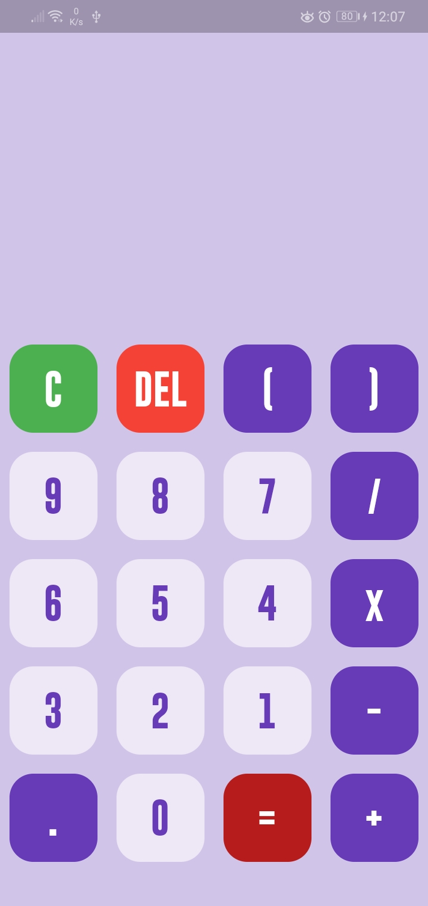
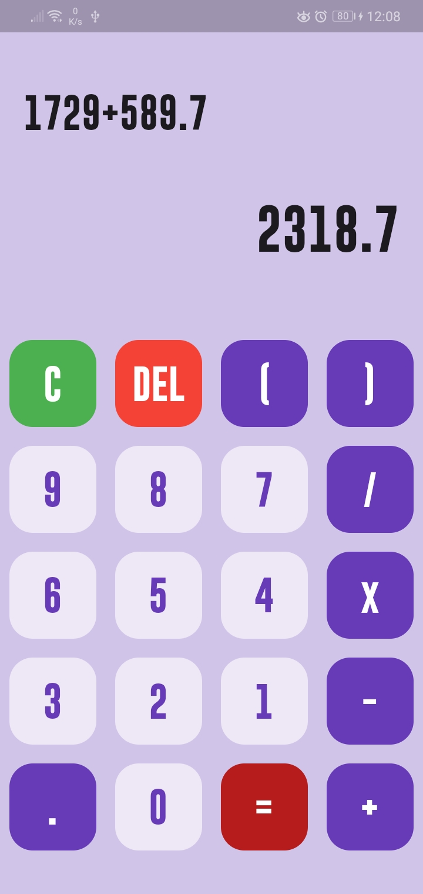

# Calculator with Flutter

Flutter is an open-source SDK, by Google, used for creating high-performance, high-fidelity mobile apps for iOS and Android. The Flutter framework makes it easy for you to build user interfaces that react smoothly in your app, while reducing the amount of code required to synchronize and update your app’s view. Flutter makes it easy to build beautiful apps with its rich set of Material Design widgets and behaviours. Here I have tried building a simple calculator with an attractive UI in Flutter.

## Screenshots
<table style={border:"none"}><tr><td></td><td></td></tr></table>

### Follow Me
 -  [Linkedin](linkedin.com/in/hemang-sinha-0485081a4)
-  [Twitter](https://twitter.com/HemangSinha)